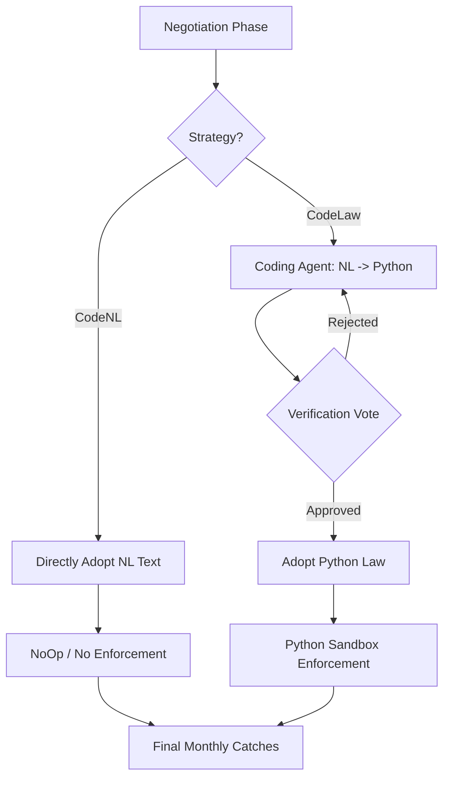

# Formal Contracting in Fishing Commons

This directory contains the logic for agents to negotiate and enforce formal agreements within the fishing commons simulation. There are two primary workflows for formal contracting: **CodeNL** and **CodeLaw**.

## Comparison Overview

| Feature | CodeNL (Constitution) | CodeLaw |
| :--- | :--- | :--- |
| **Enforcement** | None / NoOp | Python Code (Execution Sandbox) |
| **Precision** | Interpretive & Flexible | Precise & Algorithmic |
| **State** | Stateless (re-evaluated each round) | Stateful (persists via `contract_state`) |
| **Complexity** | Simple 1-phase workflow | Complex 3-phase workflow |
| **Use Case** | Rapid NL experimentation | Durable rules, sanctions, and escrows |

---

## 1. CodeNL Workflow (Constitution)

In `CodeNL` mode, agents negotiate a common constitution that outlines rules and guidelines for the lake but has no direct enforcement mechanism.

1.  **Negotiation**: Agents discuss and agree on a natural language constitution (e.g., "Each fisher catches at most 5 tons").
2.  **Adoption**: If the agreement meets the consensus threshold, it is adopted as the active constitution.
3.  **Enforcement**: None. The framework invokes a `NoOpEnforcer`, and whatever catches the fishers submit are applied without modification or algorithmic enforcement.

**Key Components:**
- **Manager**: `NLContractManager`
- **Enforcer**: `NoOpEnforcer`
- **Prompts**: `negotiation_system_prompt` in `prompts.py`.

---

## 2. CodeLaw Workflow (Python-Law Enforcement)

In `CodeLaw` mode, the natural language agreement is translated into executable code for precise enforcement.

1.  **Negotiation**: Agents agree on a natural language contract intended to be translated into Python.
2.  **Translation**: The `CodingAgent` translates the NL agreement into a `catch(name, amount, month)` Python function.
3.  **Verification (Voting)**: Agents review the generated Python code. They vote `YES` if they believe it faithfully represents their agreement, or `NO` with feedback. If rejected, the coding agent retries using the feedback.
4.  **Enforcement**: Once adopted, the code is executed via `LawEnforcer`. It can precisely set catches and utilize advanced primitives like `sanction()`, `escrow()`, and `transfer()`. It uses `contract_state` to remember things like prior violations across rounds.

**Key Components:**
- **Manager**: `LawContractManager`
- **Translation**: `CodingAgent`
- **Enforcer**: `LawEnforcer` (Python Sandbox)
- **Prompts**: `coding_agent_prompt`, `coded_contract_vote_prompt`, and `coded_contract_feedback_prompt` in `prompts.py`.

---

## Architecture Diagram

